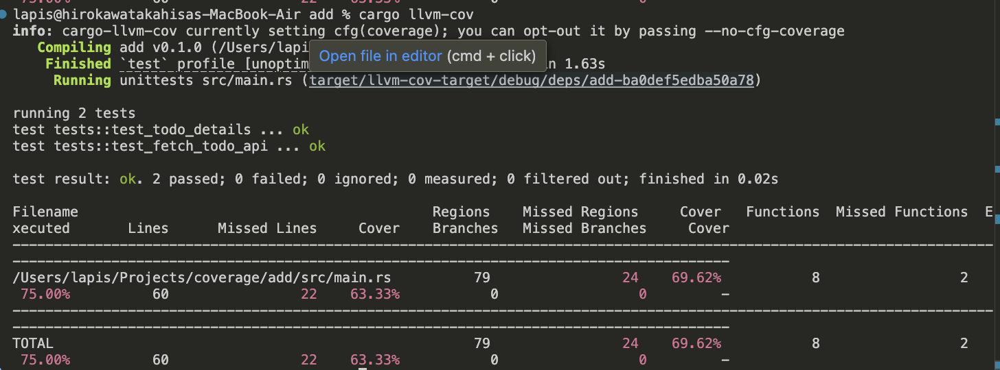

# coverage

```
cargo llvm-cov
```

上記コマンドでテスト実行しカバレッジを取得できます。

初回実行時は以下のようにツールチェーンのインストールを要求されるので、Yesにしましょう。

```
info: cargo-llvm-cov currently setting cfg(coverage); you can opt-out it by passing --no-cfg-coverage
I will run `rustup component add llvm-tools-preview --toolchain stable-aarch64-apple-darwin` to install the `llvm-tools-preview` component for the selected toolchain.
Proceed? [Y/n]
```

以下のような出力を得られれば成功です。



### その他

- HTMLで出力する

```
cargo llvm-cov --open
```
